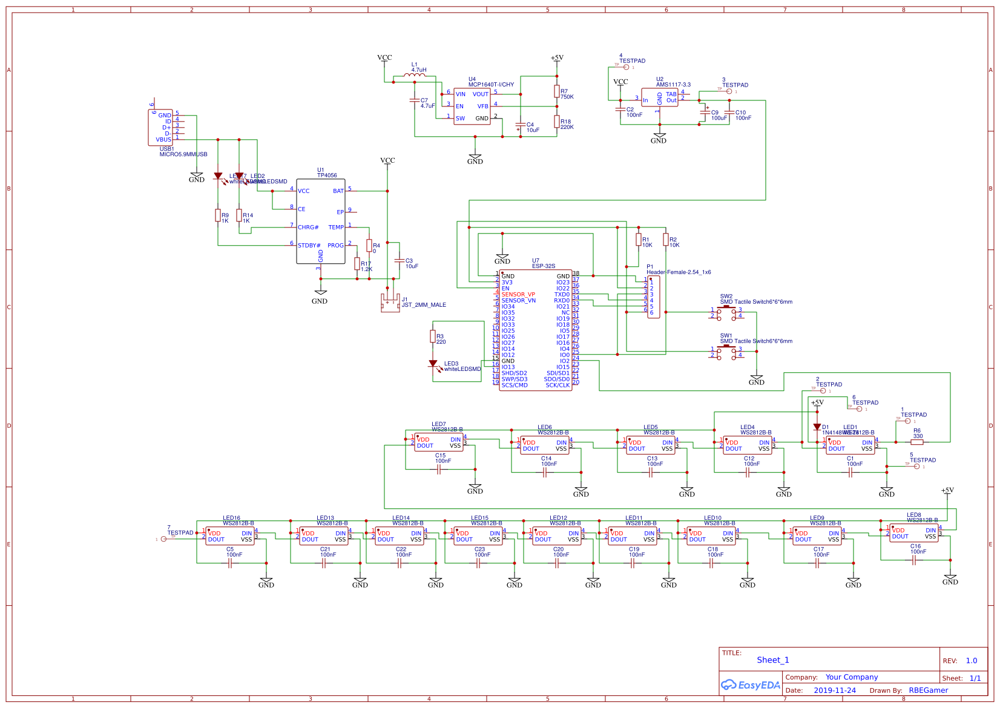
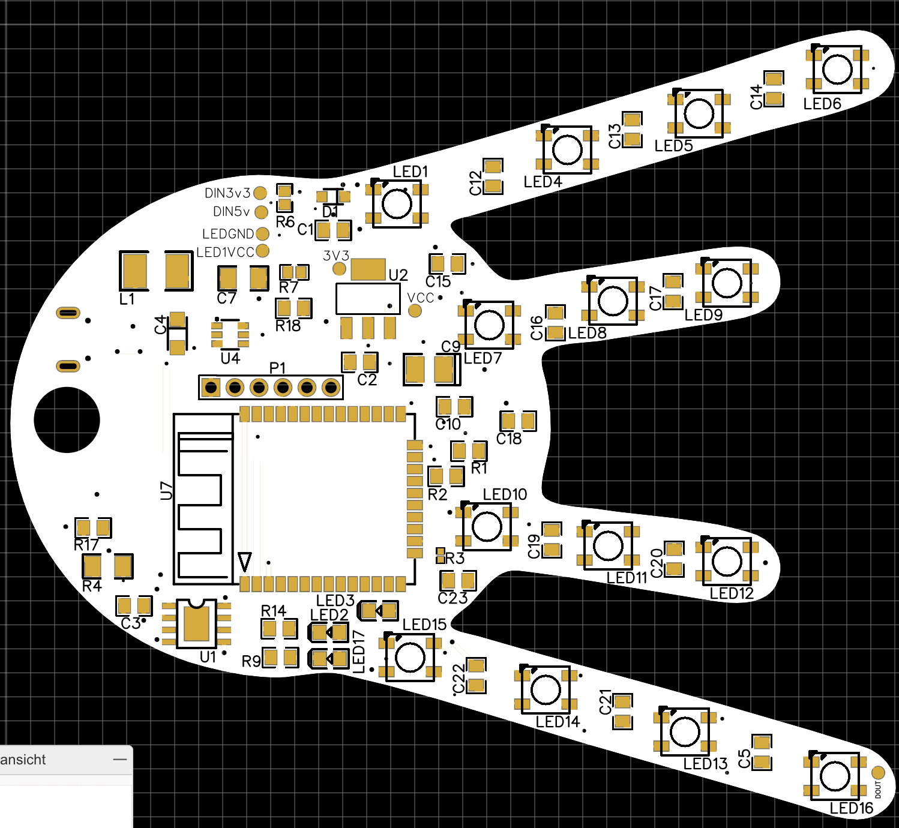
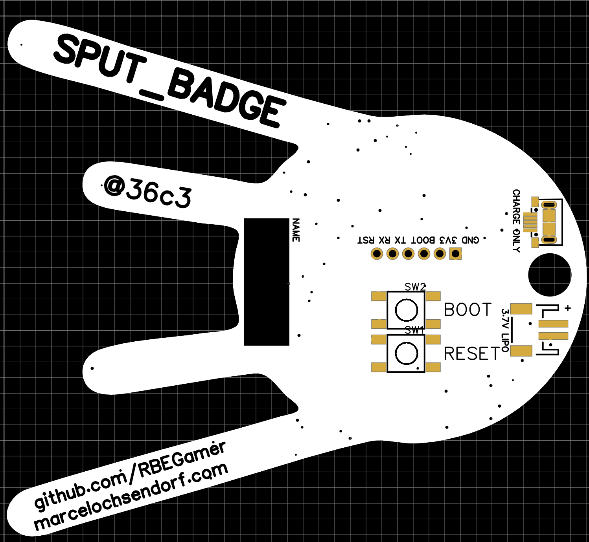

# SPUT_BADGE
A colorful BLE badge for the 36c3 event 2019

# SCHEMATIC

# PCB

# BLE

Send to the charakteristik `beb5483e-36e1-4688-b7f5-ea07361b26a8`

* `1`
* `2`
* `3`
* `4`
* `5`
* `6`
* `7`

* `99` - OTA UPDATE ENABLE
