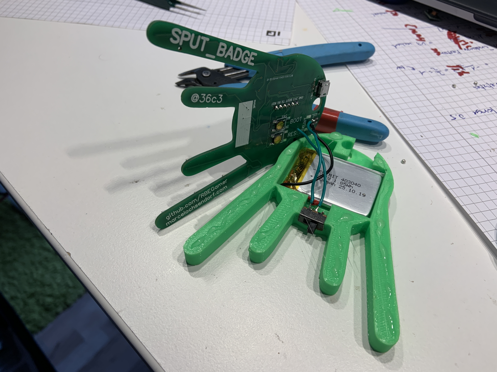
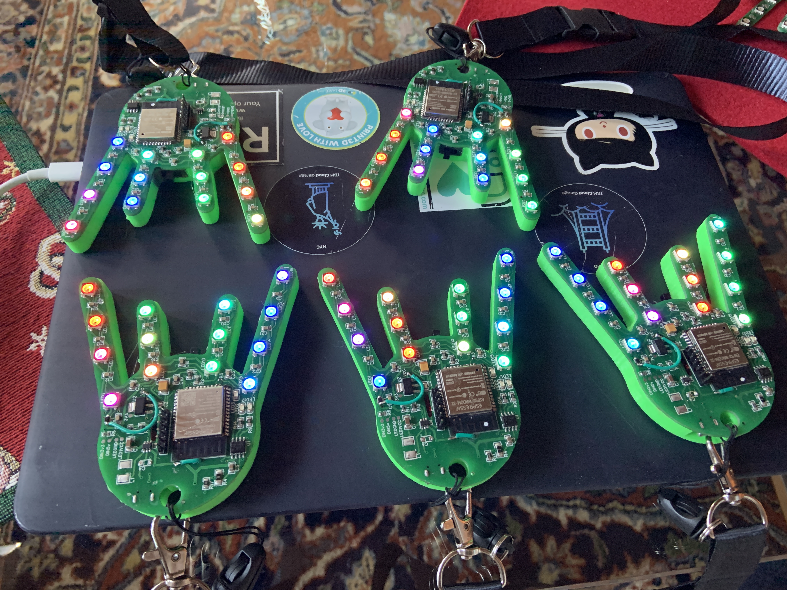

# SPUT_BADGE
A colorful BLE badge for the 36c3 event 2019 usign BLE for control and communication with other SPUTTI´s.

# SCHEMATIC

# PCB

# BLE

Send to the charakteristik `beb5483e-36e1-4688-b7f5-ea07361b26a8`

* `0` - LEDS OFF

## `1-7 LED EFFECTS`
* `1`
* `2`
* `3`
* `4`
* `5`
* `6`
* `7`

* `99` - OTA UPDATE ENABLE
* `100` - DISBALE BLE AND WIFI AND SHOW A RAINBOW ANIMATION

# FINAL RESULT

## VIDEO

## 3D Printed back case for holding the battery and powerswitch

## Badges ready for congress. With test-firmware to sync led over ble with other badges (highest chipid is master)

